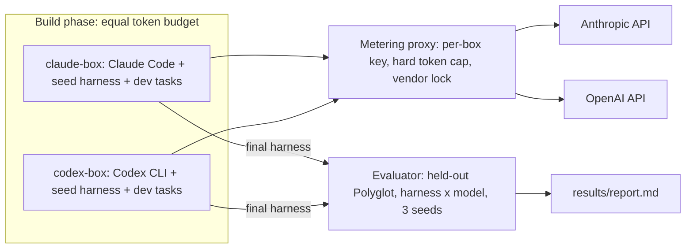

# Self-Evolving Harness Showdown: Claude Code vs Codex

Two isolated Docker containers, one running **Claude Code** (Anthropic) and one running
**Codex CLI** (OpenAI), get the **same token budget**, the same seed coding harness and the
same instructions. Each one has to turn the seed into a *self-evolving* system that rewrites
and re-tests its own harness code. Afterwards both final harnesses are scored on a hidden
test set, and the better one wins.

## Prior art

The measurement method is copied from established work rather than invented:

- **[Darwin Gödel Machine](https://github.com/jennyzzt/dgm)** ([paper](https://arxiv.org/abs/2505.22954)):
  start from a minimal seed agent, let it modify its own code, keep an archive of generations,
  and score them on the **Aider Polyglot** benchmark. The headline metric is improvement over the seed.
- **[Aider Polyglot benchmark](https://github.com/Aider-AI/polyglot-benchmark)**: 225 Exercism
  exercises in C++, Go, Java, JavaScript, Python and Rust. Prompts, test commands and the
  two-attempt rule (the second try sees the failing test output) are identical to Aider's.
- **jsbench**: each vendor's own CLI runs in a mirrored, disposable container behind an egress proxy.
- **Paired harness benchmarking**: randomized run order, clean state per run, paired per-task
  outcomes and an exact significance test.

## How it works



1. **Build phase** (`run_build.sh`). Both containers start at the same moment. Each builder
   reads [`prompts/mission.md`](prompts/mission.md) and must:
   - build an improvement loop in `/workspace/evolve/`,
   - archive every generation as `archive/gen_N/{harness/, scores.json}`,
   - leave its best harness in `/workspace/harness/`,
   - keep `NOTES.md` up to date (sessions get restarted and can only resume from these files).

   All model traffic goes through the metering proxy, including the builder CLI itself and
   every call the evolving harness makes while self-testing. When a box's budget hits zero,
   every request from that box is refused and the box stops.
2. **Evaluation phase** (`eval/run_eval.py`). Every harness, including the untouched seed
   as a baseline, is run with **both** a Claude model and a GPT model on **100 held-out
   tasks** the builders never saw, with 3 seeds each. Each solve attempt runs in a fresh
   container that can only reach the proxy. Tests run in another fresh container with no
   network.
3. **Analysis** (`eval/analyze.py`) writes `results/report.md` and the plots.

### What gets measured

| Metric | Why |
|---|---|
| **Held-out pass rate, averaged over both models** (headline) | Evaluating each harness with both models keeps a stronger model from inflating its own lab's harness |
| Improvement over the seed, per model | DGM's headline metric |
| Evolution curve, plus a re-score of 3 archived generations on held-out tasks | Shows whether the self-reported dev progress is real or overfit |
| Build tokens spent; eval tokens per solved task | Efficiency |
| Exact McNemar test on paired outcomes; bootstrap 95% confidence intervals | Small differences are mostly noise; this says which ones are not |

### Fairness and isolation

- Both boxes get the same seed, mission text, dev split, token budget and wall-clock cap.
- Boxes sit on an internal Docker network. They can reach only the proxy: the model API on
  `:8080`, and an allowlisted CONNECT tunnel on `:3128` for PyPI, npm, Go, crates.io and Maven.
  Each box's key works only for its own vendor.
- The token cap is enforced by the proxy. It counts every input token the model processed
  (fresh, cache write and cache read) plus every output token (reasoning included). Its counts
  have been checked against both CLIs' own usage reports and match exactly.
- Held-out tasks are never mounted into a build box, and reference solutions are stripped
  from every task copy. The evaluator also greps each harness for held-out exercise names.
- All 225 upstream reference solutions pass inside the test image with networking disabled,
  so a failure means the harness failed, not the toolchain.

## Requirements

- Docker with Compose v2.17+ (needed for `docker compose wait`)
- [uv](https://docs.astral.sh/uv/) and Python 3.11+
- An Anthropic API key and an OpenAI API key
- About 8 GB of disk for the images (they share a 5.5 GB base with all six language toolchains)

## Quick start

```bash
cp .env.example .env              # add ANTHROPIC_API_KEY and OPENAI_API_KEY
uv sync
uv run bench/prepare.py           # clone the pinned Polyglot repo, make dev/held-out splits
scripts/build_images.sh           # build the base, proxy, claude and codex images

./run_build.sh --fresh            # build phase: both boxes in parallel
uv run eval/run_eval.py --fresh   # 2x2 grid plus seed baseline (asks before spending)
uv run eval/run_eval.py --spotcheck
uv run eval/analyze.py            # writes results/report.md and results/plots/
```

`run_build.sh` runs `prepare.py` and builds the images itself if they're missing.
The evaluator resumes where it left off unless you pass `--fresh`.

### `run_build.sh` options

| Option | Effect |
|---|---|
| `--fresh` | Wipe the previous build workspaces and their usage logs, then start over |
| `BOXES=codex ./run_build.sh` | Run only one box (`claude` or `codex`). For smoke tests only; not a fair match |

### `eval/run_eval.py` flags

The number of runs is *harnesses × models × seeds × tasks*. With the defaults that is
3 × 2 × 3 × 100 = 1,800. Every flag overrides the matching value in `eval/config.yaml`
for that run only.

| Flag | Default | Effect |
|---|---|---|
| `--n-tasks N` | `100` | Random subset of held-out tasks (the same subset every time for a given N) |
| `--seeds N` | `3` | Repeats per (harness, model, task) |
| `--models LIST` | all | Comma-separated model aliases from the config, e.g. `gpt` or `claude,gpt` |
| `--harnesses LIST` | all | Comma-separated harness names, e.g. `claude,codex` (drop `seed` to skip the baseline) |
| `--jobs N` | `6` | Parallel task containers. Changes speed, not the number of runs |
| `--spotcheck` | off | Re-score archived generations on a 20-task held-out slice instead of the main grid |
| `--fresh` | off | Discard previous results for this mode instead of resuming |
| `--yes` | off | Skip the cost confirmation prompt |
| `--config PATH` | `eval/config.yaml` | Use a different config file |

Typical sizes:

```bash
uv run eval/run_eval.py --fresh --n-tasks 5 --seeds 1 --yes    # ~30 runs: does everything work?
uv run eval/run_eval.py --fresh --n-tasks 30 --seeds 1         # ~180 runs: a first look
uv run eval/run_eval.py --fresh --n-tasks 50 --seeds 1         # ~300 runs
uv run eval/run_eval.py --fresh                                # 1,800 runs: the full evaluation
uv run eval/run_eval.py --fresh --harnesses claude,codex --models gpt --n-tasks 30 --seeds 1   # ~60 runs, head-to-head only
```

Smaller runs are noisier. With 30 tasks and 1 seed, the 95% confidence interval on each pass
rate is roughly ±15 points, so check the intervals and p-values in the report before
declaring a winner. Keep `seed` in `--harnesses` if you want the improvement-over-seed table,
and keep both models if you want the cross-model headline. Rerunning later with a larger
`--n-tasks` (without `--fresh`) reuses only the tasks the two subsets have in common.

`eval/analyze.py` takes no flags. It reads whatever is in `results/eval/` and writes
`results/report.md` and `results/plots/`.

## Configuration

**`.env`** (build phase):

| Variable | Default | Meaning |
|---|---|---|
| `BUILD_TOKEN_BUDGET` | `2000000` | Tokens per box |
| `BUDGET_MODE` | `all` | `all` counts cache reads; `uncached` makes them free |
| `WALL_CLOCK_SECONDS` | `21600` | Hard time cap per box (6 h) |
| `MAX_SESSIONS` | `30` | Maximum number of CLI restarts per box |
| `MIN_REMAINING_TOKENS` | `20000` | Don't start a new session below this |
| `CLAUDE_BUILDER_MODEL` / `CODEX_BUILDER_MODEL` | CLI default | Model each builder CLI uses |

**[`eval/config.yaml`](eval/config.yaml)** (evaluation): the models that drive the harnesses
(`models.claude`, `models.gpt`). Each box also uses its own vendor's model from this file for
dev self-tests. The file also sets which harnesses to evaluate, the split, task count, seeds,
parallelism, per-attempt timeout and spot-check size.

To list the model IDs your keys can use:

```bash
curl -s https://api.openai.com/v1/models -H "Authorization: Bearer $OPENAI_API_KEY" | jq -r '.data[].id'
curl -s https://api.anthropic.com/v1/models -H "x-api-key: $ANTHROPIC_API_KEY" -H "anthropic-version: 2023-06-01" | jq -r '.data[].id'
```

### Choosing a budget

With cache reads counted, one agent turn costs roughly 30k to 60k tokens, because the CLI
re-reads its whole context every turn. Each self-test of a harness on dev tasks costs more on
top of that. At the default 2M tokens with small builder models, each side gets about
10 minutes: enough to write an evolve loop, but not enough to run it for many generations.
For a meaningful contest, use `BUILD_TOKEN_BUDGET=10000000` or more, or set `BUDGET_MODE=uncached`.

## Monitoring a run

```bash
docker compose --profile build ps                          # are the boxes still up?
tail -f results/build/*/workspace/.build_logs/loop.log     # sessions and remaining budget
for b in claude codex; do echo -n "$b: "; tail -1 results/usage/$b-box.jsonl | jq -c '{cum, model}'; done
ls results/build/*/workspace/archive/                      # generations so far
cat results/build/claude/workspace/NOTES.md                # each side's own notes
```

Each builder's full event stream is in `results/build/<box>/workspace/.build_logs/session_N.jsonl`.

## The harness contract

Every harness, both the seed and the evolved ones, is a Python package invoked as:

```bash
python -m harness solve <task_dir> --model <model_id> [--feedback <file>]
```

- `<task_dir>` holds the exercise files and `TASK.md`. The tests are hidden.
- `--feedback` is passed on the second attempt and contains the failing test output.
- Model IDs starting with `claude` go to Anthropic; everything else goes to OpenAI.
- Pip dependencies go in `harness/requirements.txt` and are installed into the eval image.

The seed in [`seed/harness/`](seed/harness/) is deliberately minimal: one bash command per
turn, at most 30 steps, standard library only.

To score any harness on dev tasks locally (the builders use the same tool inside their boxes):

```bash
python bench/polyglot.py eval-dev --harness-root seed --tasks data/tasks/dev --model gpt-5.4-mini -n 10 -j 4
```

## Repository layout

```
bench/polyglot.py       Shared task loader, Aider-identical prompts and tests, dev scorer
bench/prepare.py        Clone the pinned benchmark; make the stratified dev (50) / held-out (100) split
bench/reference.py      Run upstream reference solutions (cache warm-up and toolchain check)
seed/harness/           The seed harness both sides start from
prompts/mission.md      The instructions given to both builders
proxy/meter.py          Token-metering, vendor-locking reverse proxy plus allowlisted CONNECT proxy
docker/                 Base toolchain image, builder images, proxy image, builder loop
docker-compose.yml      Proxy and the two boxes on an internal network
run_build.sh            Build phase orchestration
scripts/                Image build, key generation, build summary
eval/run_eval.py        Official evaluator (2x2 plus seed, spot check)
eval/analyze.py         Statistics, report and plots
eval/config.yaml        Evaluation settings
```

Generated output (gitignored):

```
data/                   Benchmark clone and task splits
proxy/config/keys.json  Virtual keys (real API keys live only in the proxy's environment)
results/build/          Each box's workspace, archive, logs and frozen final_harness
results/usage/          Per-key token logs from the proxy
results/eval/           runs.jsonl, spotcheck.jsonl, summary.json, per-task work dirs
results/report.md       The final report
```

## Caveats

- **The cap can overshoot slightly.** It is checked before each request, so requests already
  in flight when the budget runs out still complete.
- **Model strength differs.** Pin builder and eval models deliberately. Reasoning models spend
  output tokens on reasoning, which counts against the budget.
- **One run is one sample.** Builder behavior varies a lot between runs. Repeat the build
  phase before drawing strong conclusions about which lab is better.

## License

[MIT](LICENSE)
